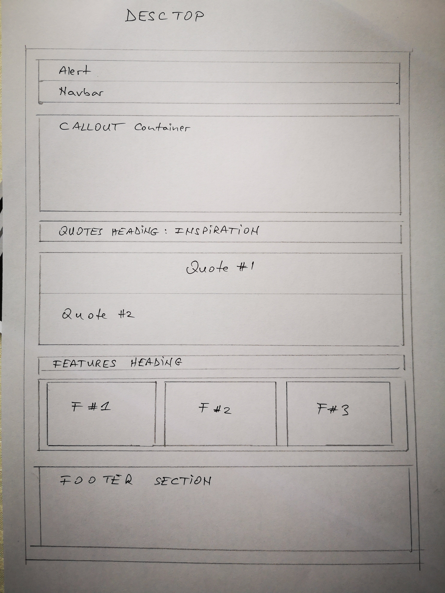
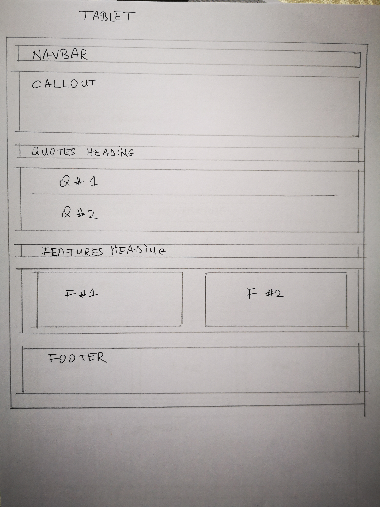
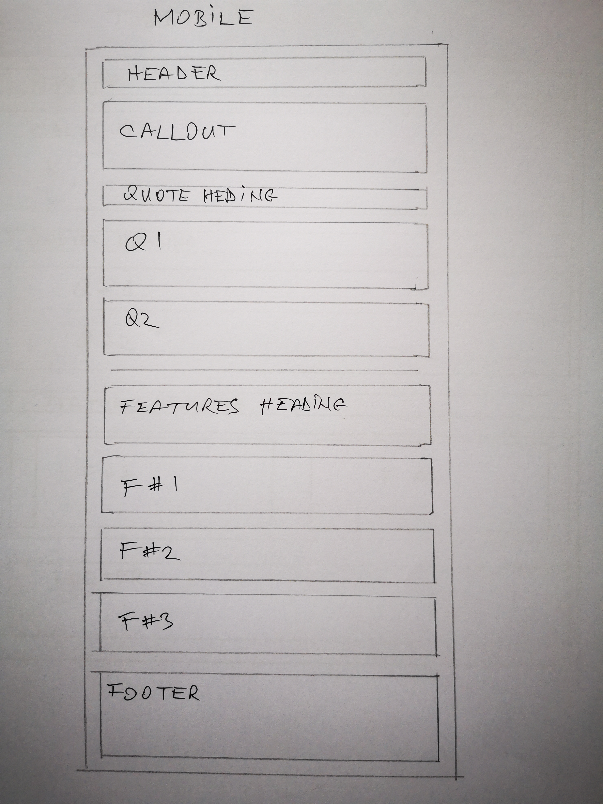

# [__Study Romanian__ | Learn Romanian Language in Your School](https://csababorzasi.github.io/milestone-one/.)

*Code Institude Milestone Project #1*
***

## Project Overwiew
***
My wife is a Romanian Language teacher and there are many Romanian  children in Ireland 
who are going to loose their language because they are not learning it sistematically. 
The aim of this website is to raise awareness of this issue and to provide information of
the many opportunitis there are for these children. I also want to provide healpful 
information for students who are ahead of the Leaving Certificate exam, that they have a 
great opportunity of beaing able to choose their nativ language as an exam subject
with higher level grading possibility. Chosing this will provide extra points to their 
marks. 

## Table of Content
***
# Table of contents

1. [UX](#heading2)
    * [Project Goals](#heading3)
    * [User Stories](#heading3)
    * [Wireframes](#heading3)
    * [Design Choices](#heading3)
        * [Font](#heading4)
        * [Colors Used](#heading4)
2. [Features](#heading2)
    * [Project Goals](#heading3)
    * [User Stories](#heading3)
3. [Technology Used](#heading2)
4. [Validation](#heading2)
    * [W3C HTML Validator](#heading3)
    * [W3C CSS Validatior](#heading3)
5. [Deployment](#heading2)
6. [Credits](#heading2)
    * [Content](#heading3)
    * [Images](#heading3)
    * [Video](#heading3)
    * [Code](#heading3)

## UX
***
### Project Goals
The primary goal of this website is to provide information for students and their parents 
about the **Romanian Language, Culture, and Civilization** course that is available for free as 
a school curicculum for every Romanian pupil in Ireland. Also want to give information about 
how to introduce the course in their own school. 

An other goal is to promote **Romanian as a Leaving Certificate exam subject** to be chosen by
more and more students, as the subjects are not difficult for those who speak the language and 
enroll for the preparation classes. This has the potential of increasing their final marks and
thus way increasing the chances of getting accepted to their desired colleges and faculties. 

The third goal of this project is to promote the **Romanian Summer Camps** amon the secondary
school students. The camps are packed with lots of diverse and informative activities and curriculum
and also offers the possibility to meet new people and develop new and meaningful friendships
in a fun environment.

### User Stories
1.	As a user I want to get the information that I am looking for quickly, and if I am interested
being able to read some more. 
2.	As a user I want to be able to get a quick and clear overwview of the website and to be able to 
get where I want in there in one click. 
3.	As a user I want to be able to get in touch with the organizers and teachers of the Romanian 
School if I need more information or need to clarify some things regarding the information offered 
on the website
4.	As a user, student or parent, I want to connect to the school through social media and get 
updated information in real time. 

### Wireframes
I chose to draw the wireframes by hand and taking a picture of them:

### Design Choices
I wanted to capture the theme of the Pokémon franchise and the essence of the retro Pokémon games 
for this app. The following design choices were made with this requirement:

#### Font
I am using **Roboto** font from Google Fonts, and also **Font Awesome** for styling the social
media icons. 

#### Colours used

-  `#b52606`
-  `#c32b2b`
-  `#df4929`
-  `#fa163f`
-  `#ff570c`
-  `#e6d04c`
-  `#fff`
-  `#f7f7f7`
-  `#e7eff3`
-  `#ccc`
-  `#cdd5e0`
-  `#05259a`
-  `#323643`
-  `#444`

## Features
***
### Existing Features
- Navbar
- Alert
- Callout
- Buttons
- Social icons
- Image container

### Further Recommandations
I am planning to add a bootstrap **Multi-item carousel gallery** in the summer camp section 

## Technology used
***
*	HTML - used as the foundation of the website 
*	CSS - used for styling the components
*	Bootstrap - the website was buit with the help of Bootstrap with mobile first design kept in mind
*	Google Fonts – in this project I used 'Roboto' font from Google Fonts
*   Font Awesome - used for styling the social and contact icons in the Navbar and Footer
*   GitHub - used to store this project
*   Gitpod - used as choice integrated development environment (IDE)

## Validators
***
### W3C HTML Validator
One warning was found in the **index.html** file, where my image cards are lacking headings. 
I considered headings not needed in this situation.

In the **summer-camp.html** I have two errors. One is stating that the `center` element is obsolate. 
But when I wanted to use CSS o place the video to the center and to be responsive, I couldn't figure 
it out how to do it. The other error is tha `frameborder` attribute on the  `iframe` element is 
obsolate and that I should be using CSS instead. As this is the vimeo embedd code that was generated 
I didn't wanted to change. 

There are no errors or warnings in the next three html's: **leaving-cert.html**, **about.html**, 
and **romanian-classes.html**

### W3C CSS Validator
In my css file I have one error, but here again I culdn't figure out any solution. 
There are a few alerts, stating that I used the same color backgroung and border was used. 
That was done purposefully. The other type of error has to do with the webkit-background and 
flex vendor extentions that I don't want to remove, as removing would affect how the website 
would work. 

### Browser & Device Compability
•	Chrome - no issues.
•	Firefox - no issues.
•	Huawei P20 Pro
•	iPhone X
•	Galaxy s5
•	iPhone 6/7/8

## Deployment
***
This project was developed using the GitPod IDE, committed to git and pushed to GitHub.

## Credits
***
### Content
The text included in this website was written by me with ideas given by my wife, as this webside 
was created for her purposes as well, as she is the Romanian Language teacher mentioned in the website. 
### Images
Most of the images are from **Pixabay** and are free to be used. The narrower ones used as page 
header background images are from **Freewebheaders** and are free to be used as well. I also 
used some personal images as well. 
### Video
I embedded a video from **Vimeo** that shows some interviews from last year's summer camps. 
### Code
I've got inspiration from **Bootstraps** website about some elements in my webpage, such as 
image cards, social icons included in the header and callout. Also searched for some anwers 
on **#slack** and **Stackoverflow**